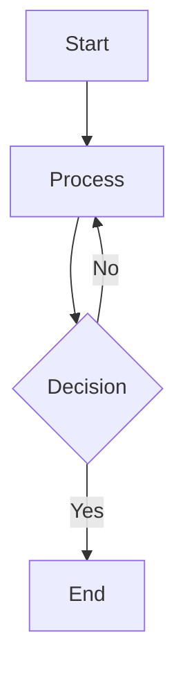

# ⚡ Quick Start Guide - MermaidForge

**Get MermaidForge running in 5 minutes!**

---

## 🎯 For Users (Non-Developers)

### Option 1: Portable Version (Recommended)

1. **Download** `MermaidForge_Portable.zip` from [Releases](https://github.com/VOTRE_USERNAME/MermaidForge/releases)
2. **Extract** to any location (USB drive, D:\, OneDrive, etc.)
3. **Double-click** `MermaidForge.exe`
4. ✅ **Done!** Start converting diagrams

**No installation, no admin rights needed!**

### Option 2: Installer Version

1. **Download** `MermaidForge-setup.msi` from [Releases](https://github.com/VOTRE_USERNAME/MermaidForge/releases)
2. **Run installer** (admin rights required)
3. **Launch** from Start Menu
4. ✅ **Done!**

---

## 👨‍💻 For Developers

### Prerequisites

Install these first:
- ✅ **Node.js 18+** - https://nodejs.org
- ✅ **Rust 1.75+** - https://rustup.rs
- ✅ **Git** - https://git-scm.com

### Quick Setup

```bash
# 1. Clone the repository
git clone https://github.com/VOTRE_USERNAME/MermaidForge.git
cd MermaidForge

# 2. Run setup (Windows PowerShell)
.\setup-dev.ps1

# OR manually:
npm install

# 3. Start development server
npm run tauri dev
```

**That's it!** The app will open with hot-reload enabled.

### Build Production

```bash
# Portable version
npm run tauri:build:portable

# Installer version
npm run tauri:build:msi

# Both versions
npm run build:all
```

**Output**: `src-tauri/target/release/`

---

## 📝 First Conversion

### Step 1: Create a test file

Create `test.mmd`:


### Step 2: Convert

#### Via UI
1. Open MermaidForge
2. Drag `test.mmd` into the drop zone
3. Click "Convert All"
4. ✅ Files saved in output folder!

#### Via Code (SOLARIS integration)
```rust
use mermaidforge_lib::{MermaidForge, ConversionConfig};

let forge = MermaidForge::new()?;
let code = std::fs::read_to_string("test.mmd")?;
let svg = forge.convert(&code, ConversionConfig::default()).await?;
std::fs::write("test.svg", svg)?;
```

---

## 🔧 Configuration

### Settings Location

**Portable Mode**:
```
MermaidForge/
├── MermaidForge.exe
├── portable.flag        # ← Enables portable mode
├── config/
│   └── settings.json   # ← Your settings
└── output/             # ← Generated files
```

**Installed Mode**:
```
C:\Users\YourName\AppData\Roaming\MermaidForge\
└── config\settings.json

C:\Users\YourName\Documents\MermaidForge\
└── output\              # ← Generated files
```

### Default Settings

```json
{
  "output": {
    "custom_directory": null,
    "create_subfolders_by_date": false,
    "formats": {
      "svg_transparent": true,
      "svg_light": true,
      "svg_dark": false,
      "png_2048": true,
      "png_4k": false
    }
  },
  "branding": {
    "theme": "orange-business",
    "show_logo": true
  }
}
```

---

## 🐛 Troubleshooting

### "Application failed to start"

**Check**:
- Windows 10 version 1809 or later
- WebView2 runtime installed (auto-installed by installer)

**Solution**: Download WebView2 from https://developer.microsoft.com/microsoft-edge/webview2/

### "Conversion failed: Chromium error"

**Cause**: Chromium initialization failed

**Solution**:
1. Clear cache folder
2. Restart application
3. Check antivirus isn't blocking

### "Files not appearing in output"

**Check**:
- Output directory exists and is writable
- No permissions issues
- Disk space available

**Solution**: Open Settings → Change output directory

---

## 📚 Learn More

- **Full Documentation**: [README.md](README.md)
- **GitHub Guide**: [GITHUB_GUIDE.md](GITHUB_GUIDE.md) (for beginners)
- **Contributing**: [CONTRIBUTING.md](CONTRIBUTING.md)
- **Changelog**: [CHANGELOG.md](CHANGELOG.md)

---

## 💬 Get Help

- 🐛 **Bug Reports**: https://github.com/VOTRE_USERNAME/MermaidForge/issues
- 💡 **Feature Requests**: https://github.com/VOTRE_USERNAME/MermaidForge/discussions
- 📧 **Email**: drissman@gmail.com

---

## ⚡ Tips

### Keyboard Shortcuts (coming in v1.1)

- `Ctrl+O` - Open files
- `Ctrl+S` - Save
- `Ctrl+,` - Settings
- `F5` - Refresh preview

### Batch Conversion

For large numbers of files:
```bash
# In the output directory, run:
for file in *.mmd; do
    mermaidforge convert "$file"
done
```

### Integration with SOLARIS

Add to `Cargo.toml`:
```toml
[dependencies]
mermaidforge = { path = "../MermaidForge/src-tauri" }
```

Then:
```rust
use mermaidforge::{MermaidForge, ConversionConfig};

let forge = MermaidForge::new()?;
// Use in your code
```

---

**🎉 You're ready to go! Happy diagramming!**
